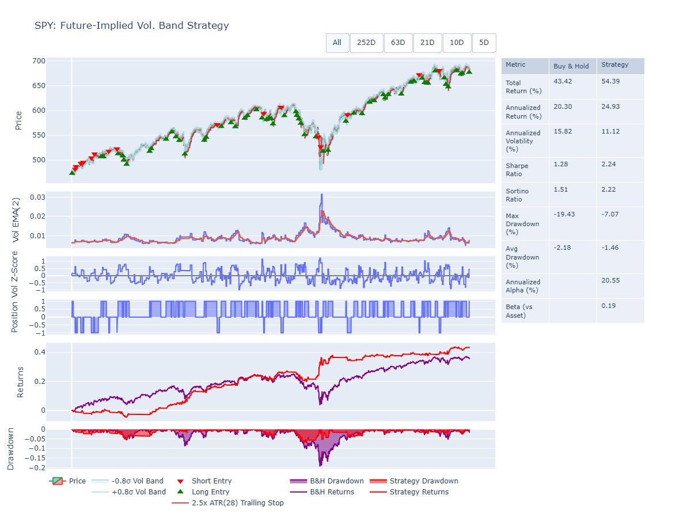
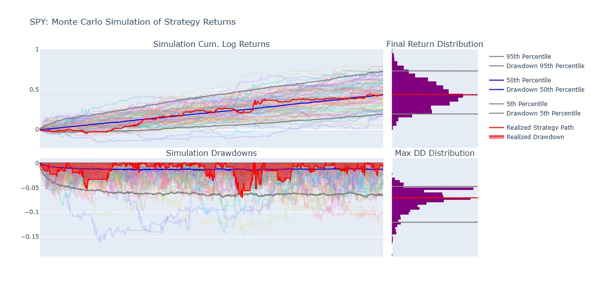
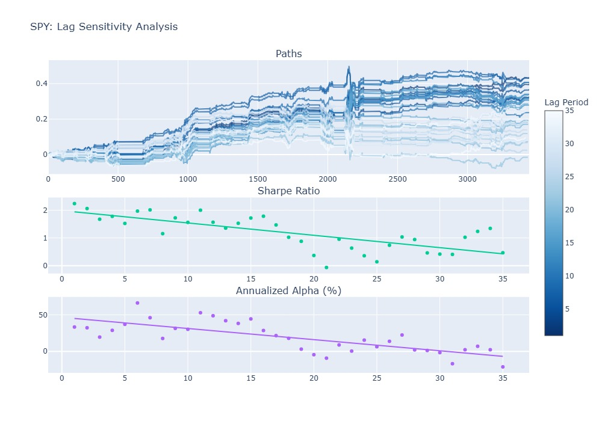
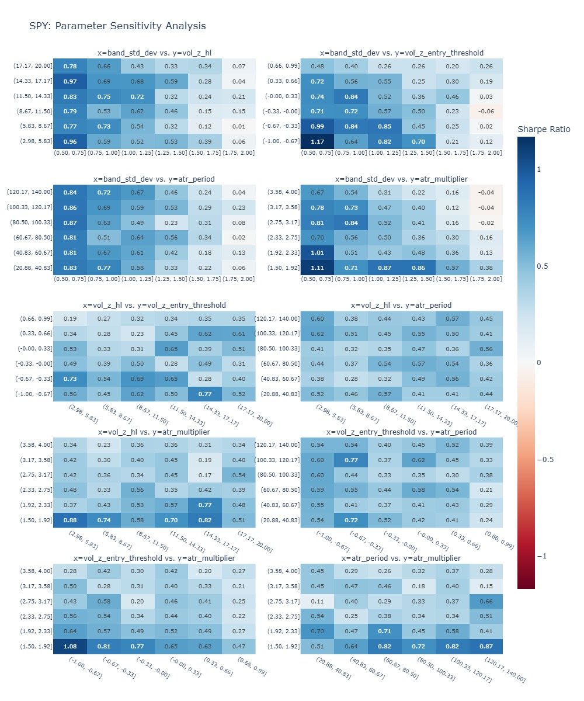

# Future-implied Volatility Band Strategy Backtest

## Idea

This strategy is an intraday mean-reversion system triggered by volatility extremes. It calculates price bands based on implied volatility (the market's expected daily move) and only enters trades when the IV Z-score is high, indicating an environment of elevated fear. Positions are initiated when the price dips below the lower band and begins to recover, or peaks above the upper band and starts to fade. Once a trade is active, an ATR-based trailing stop manages the exit, locking in gains as the price moves favorably without utilizing a fixed profit target.

## Backtest

The strategy was backtested on 30m candlestick data, and daily historical options chain data from the S&P500 (SPY) over a 2-year period.

### Performance Summary

The strategy delivers a total return of 65.17% with an annualized return of 29.33%, significantly outperforming the SPY buy-and-hold benchmark of 20.30%. It achieves this with a substantially reduced maximum drawdown of -7.07% compared to the market's -19.43%. The high Sharpe Ratio of 2.54 and Sortino Ratio of 2.67 indicate that the system provides high risk-adjusted returns by successfully timing entries during high-volatility "fear" events and managing exits via an ATR-based trailing stop.



### Robustness and Execution

The strategy shows high structural stability across multiple tests. The parameter sensitivity heatmaps reveal broad "clusters" of profitability, suggesting the results are not the product of over-optimization or "curve-fitting." Because the data uses 30-minute candles, the lag sensitivity analysis confirms the strategy is not overly dependent on high-speed execution; the edge remains viable even if entries are delayed by several hours. Additionally, Monte Carlo simulations show the realized strategy path aligns with the 50th percentile of expected outcomes, reinforcing that the performance is statistically representative rather than an outlier.







## Setup

```shell
$ pip install -r requirements.txt
$ dolt --data-dir ./db sql -f setup.sql <-- Clones and sets up indexes on Dolt post-no-preference/options repository.
```
