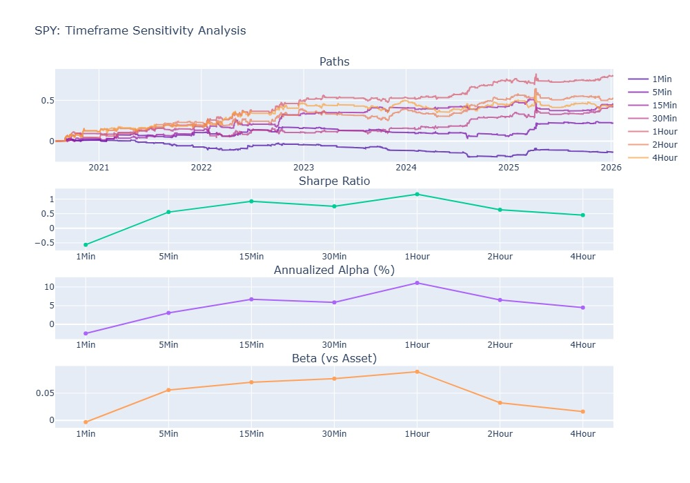

# SPY Vol. Regime-Adaptive Strategy Backtest

## Idea

This strategy is a regime-adaptive hybrid system that leverages price volatility and technical trends to switch between mean-reversion and trend-following logic. By calculating a **Volatility Z-score**, the system identifies "high-fear" or overextended environments to execute mean-reversion trades using volatility bands. In stable or low-volatility regimes, it shifts to a trend-following mode guided by moving average crossovers. Risk is managed through a **3.0x ATR trailing stop**, ensuring that capital is protected during sudden reversals while allowing winning trades to run.

## Backtest

The strategy was backtested on the S&P 500 ETF (SPY) from **January 2020 to January 2026**, capturing the high-volatility COVID-19 era and the subsequent recovery cycles.

### Performance Summary


#### Key Insights

- **Hybrid Strategy**: This regime-adaptive system achieved a **276.40% Total Return** with a **Sharpe Ratio of 1.56**. By dynamically switching between logic sets, it captured the highest Annualized Alpha (**17.56%**) while maintaining a defensive profile, effectively smoothing the equity curve during periods of market transition.
- **Mean Reversion**: This component serves as the primary risk-mitigation engine during high-volatility spikes. It delivered the highest standalone risk-adjusted return relative to its volatility, maintaining a remarkably low **0.09 Beta**. This highlights its ability to profit from "fear-based" overextensions with almost zero correlation to the broader market trend.
- **Trend Following**: Acting as the "capital preservation" mode during stable regimes, this approach focuses on riding sustained momentum. While it produced a lower annualized return (**9.23%**) than the other modes, it provided the lowest maximum drawdown (**-9.83%**), ensuring the strategy remained invested during low-volatility climbs without over-trading noise.
- **Risk Mitigation**: The synergy of the three approaches reduced the benchmark's maximum drawdown by over **60%**. The use of a 3.0x ATR trailing stop across all modes ensured that while the Hybrid strategy captured aggressive upside, it successfully avoided the deep "tail-risk" events seen in the Buy & Hold benchmark.

---

## Robustness

### Monte-Carlo Simulation


To test for path dependency, the strategy was subjected to 1,000 simulations using a Stationary Bootstrap to shuffle returns while preserving their natural time-series structure.

- **Representative Results:** The realized strategy path (red line) tracks the **50th percentile** of simulations, suggesting the backtest is a realistic expectation of average performance.
- **Risk Floor:** The realized drawdown remained significantly shallower than the 95th percentile of simulated outcomes.

### Timeframe Sensitivity



The strategy was evaluated across intervals from 1-minute to 4-hour bars, while keeping all other parameters temporally constant (i.e. same lookback periods and thresholds).

- **Optimal Window:** Performance peaks at the **1-hour timeframe** (Sharpe ~1.6, Alpha ~17%).
- **Edge Decay:** Effectiveness drops at the 4-hour scale, suggesting the volatility-band signals are most predictive on intra-day to multi-day horizons.

### Lag Sensitivity


Tested execution delays from 0 to 33 periods (~5 6.5hr days) to ensure the strategy isn't dependent on "perfect" fills.

- **Entry vs. Exit:** The strategy is more sensitive to entry lag, but the **Alpha remains positive** even with significant delays, proving the signals capture structural market shifts rather than fleeting noise.

### Parameter Sensitivity


Heatmaps were generated to identify "parameter islands" and ensure stability.

- **Consistent Alpha:** The system shows broad "blue zones" of profitability across various combinations of `vol_z_entry_threshold` and `band_std_dev`.
- **Robustness:** High performance is clustered, not isolated, indicating that slight variations in settings will not collapse the strategy’s edge.

## Setup

```bash
# Install dependencies
pip install -r requirements.backtest.txt
```

## Run Bot

```bash
docker compose up
```

_Disclaimer: This report is for informational purposes only and does not constitute financial advice. Past performance is not indicative of future results._
